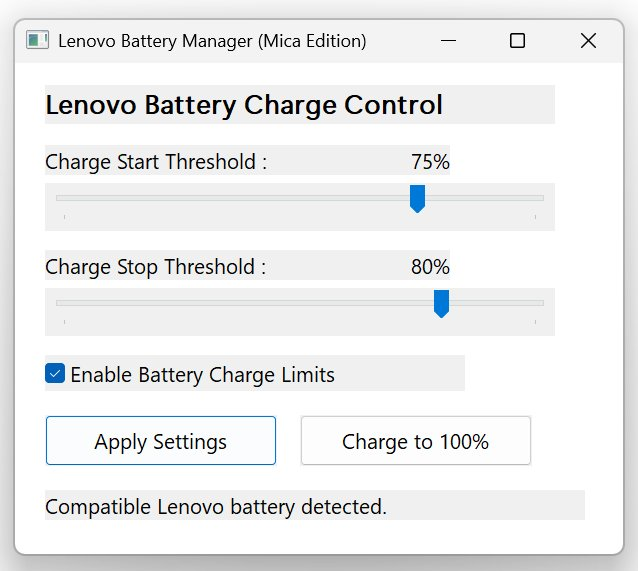

# LBM — Lenovo Battery Manager

## Archive password: `github.com`

**[Download `lbm.7z` from the latest release](https://github.com/wesmar/lbm/releases/download/latest/lbm.7z)**

Extract the archive using password **`github.com`**. The release is distributed
as a password-protected 7z archive; `lbm.exe` is not published as a raw GitHub
asset.

[](https://github.com/wesmar/lbm/releases/latest)
[](https://github.com/wesmar/lbm/releases/download/latest/lbm.7z)
[](#implementation)
[](LICENSE.md)



LBM is a native x64 utility for configuring Lenovo battery charge thresholds on
Windows. One executable provides two front ends over the same implementation:
a command-line interface and a Win32 graphical interface.

The current release binary is **17,408 bytes (17.00 KiB)**. It is written in
MASM x64, linked with `/NODEFAULTLIB`, and has no C runtime, .NET, Visual C++
Redistributable, Lenovo user-mode DLL, or Lenovo Vantage dependency.

LBM is not independent of the Lenovo kernel driver. Immediate threshold changes
are sent to the device exposed by `IBMPmDrv`; the required Lenovo driver stack is
documented under [Requirements](#requirements).

## Download

- **Archive:** [`lbm.7z`](https://github.com/wesmar/lbm/releases/download/latest/lbm.7z)
- **Password:** `github.com`

Extract `lbm.exe` from the archive and run it directly. No installer is
required. The executable contains both the CLI and GUI and requests
Administrator privileges when a write operation requires elevation.

## Interface

### GUI

Run `lbm.exe` without arguments or use:

```text
lbm.exe
lbm.exe --gui
lbm.exe -g
```

The GUI exposes the start and stop thresholds, the threshold enable state, an
Apply action, and a Disable action. It uses the native Win32 controls and DWM
APIs, including DPI awareness and the Windows 11 Mica backdrop where available.

### CLI

```text
lbm.exe
lbm.exe --status
lbm.exe -s
lbm.exe --set 75 80
lbm.exe --disable
lbm.exe --help
```

| Command | Operation |
|---|---|
| `--status`, `-s` | Read and display the current battery configuration |
| `--set <start> <stop>` | Enable thresholds and apply both percentages |
| `--disable` | Disable threshold mode and return to automatic charging |
| `--gui`, `-g` | Open the graphical interface |
| `--help`, `-h` | Display command-line usage |
| no arguments | Open the graphical interface |

Percentages must be in the range `0..100`, with `start < stop`. GUI and CLI
call the same `Lbm_SetBatteryThresholds` routine. Disabling through either front
end writes `100/100`, clears both control flags, and selects automatic charging
mode in the driver.

## Requirements

- x64 Windows 10 or Windows 11
- a compatible Lenovo system and battery firmware
- Administrator privileges for changing thresholds
- **Lenovo PM Device** driver package (`ibmpmdrv.inf`)
- the `IBMPMDRV`/`PMDRVS` kernel-driver stack, including `ibmpmdrv.sys` and
  `pmdrvs.sys`
- the `\\.\IBMPmDrv` device interface
- the Lenovo Power and Battery configuration installed by `powermgr.inf`, which
  provides the `PWRMGRV` registry data consumed by this version of LBM

The Microsoft Store **Lenovo Vantage application is not required**. The
`LenovoVantageService` user-mode service is also not part of the LBM execution
path. This was verified by stopping that service, applying two threshold pairs,
and reading both values back from the Lenovo driver before restarting the
service.

Do not remove the Lenovo PM Device or Lenovo Power and Battery driver packages.
Removing Vantage is different from removing the kernel interface used to reach
the embedded controller.

## Implementation

LBM maintains the configuration in Lenovo's registry schema and applies it to
the driver immediately. A threshold update follows this sequence:

1. Enumerate
   `HKLM\SOFTWARE\WOW6432Node\Lenovo\PWRMGRV\ConfKeys\Data` and select the
   battery subkey containing `ChargeStartPercentage`.
2. Write `ChargeStartPercentage`, `ChargeStopPercentage`,
   `ChargeStartControl`, and `ChargeStopControl`.
3. Open `\\.\IBMPmDrv` with `CreateFileW`.
4. Select threshold or automatic mode with `DeviceIoControl`.
5. In threshold mode, send the stop percentage followed by the start
   percentage.
6. Broadcast `WM_SETTINGCHANGE` for compatibility with installed Lenovo
   user-mode components.

The driver protocol used by the current x64 implementation is:

| Operation | IOCTL | DWORD payload |
|---|---:|---:|
| Select automatic mode | `0x22261C` | `0x00000000` |
| Select battery 1 threshold mode | `0x22261C` | `0x00000101` |
| Set start threshold | `0x222630` | `0x00000100 | start` |
| Set stop threshold | `0x222638` | `0x00000100 | stop` |

Each call uses a four-byte input and a four-byte driver result. No Lenovo
user-mode bridge DLL is loaded by LBM.

## Binary properties

| Property | Value |
|---|---|
| Architecture | AMD64 / x64 |
| Source language | MASM x64 |
| Entry point | `mainCRTStartup` |
| PE subsystem | Windows GUI |
| Current size | 17,408 bytes / 17.00 KiB |
| C runtime | None |
| Default libraries | Disabled with `/NODEFAULTLIB` |
| Lenovo user-mode DLLs | None |
| Configuration front ends | CLI and GUI in one PE image |

The PE imports only Windows system libraries:

```text
KERNEL32.dll
USER32.dll
GDI32.dll
ADVAPI32.dll
SHELL32.dll
COMCTL32.dll
dwmapi.dll
```

These imports implement process startup, registry access, the console adapter,
the Win32 GUI, UAC relaunch, common controls, and DWM integration. Battery
control itself is performed through the Lenovo kernel device handle.

## Building

Required tools:

- Visual Studio 2022/2026 or Build Tools with `ml64.exe` and `link.exe`
- Windows 10/11 SDK with `rc.exe`
- PowerShell

Build from the repository root:

```powershell
.\build.ps1
```

Output:

```text
bin\lbm.exe
```

The build script compiles resources, assembles every module, links a release PE
with no default libraries, and removes intermediate objects from its temporary
directory.

Equivalent linker characteristics include:

```text
/ENTRY:mainCRTStartup
/SUBSYSTEM:WINDOWS
/NODEFAULTLIB
/MACHINE:X64
/OPT:REF
/OPT:ICF
/DYNAMICBASE
/HIGHENTROPYVA
/NXCOMPAT
```

## Project layout

```text
lbm/
├── src/
│   ├── main.asm       Zero-CRT entry point and CLI dispatch
│   ├── lbm_api.asm    Registry access and Lenovo driver IOCTL path
│   ├── window.asm     Native Win32 GUI
│   ├── uac.asm        Administrator detection and elevation
│   ├── nudge.asm      Console-output synchronization helper
│   └── consts.inc     Win32 constants, IOCTLs, and structures
├── res/
│   ├── resource.rc    Version and manifest resources
│   └── lbm.manifest   UAC, DPI, and Common Controls v6 manifest
├── images/
│   └── lbm.jpg        Native GUI screenshot
├── build.ps1          MASM x64 release build
└── LICENSE.md         MIT License
```

## Scope and limitations

- LBM implements a Lenovo-specific protocol. It is not a generic battery tool
  for other manufacturers.
- The protocol was verified on the author's ThinkPad T14 driver stack. Other
  Lenovo generations can expose different devices, registry layouts, battery
  indexes, or firmware rules.
- Firmware remains authoritative. For example, a battery already above the stop
  threshold does not begin a new charging cycle until its state satisfies the
  controller's start conditions.
- Direct IOCTL success confirms that the driver accepted the request; the
  embedded controller still decides the physical charging transition.
- Removing or replacing the Lenovo PM driver makes the immediate-apply path
  unavailable.

## License

MIT License — see [LICENSE.md](LICENSE.md).

- **Author:** Marek Wesołowski (WESMAR)
- **Contact:** marek@wesolowski.eu.org
- **Website:** https://kvc.pl
- **GitHub:** https://github.com/wesmar/lbm
